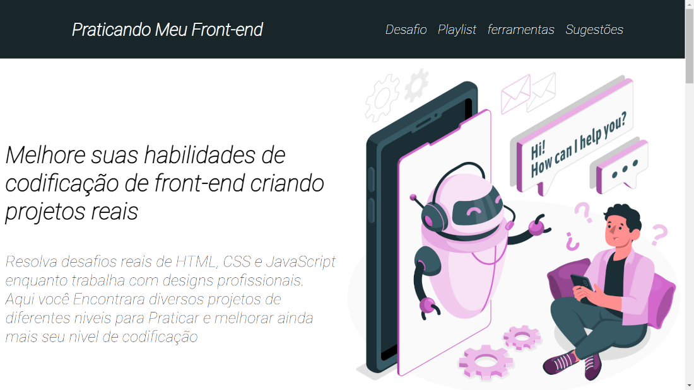

# praticando-meu-front-end

## A principal ideia desse projeto é trazer desafios relacionados a front-end e ferramentas para desenvolvimento que utilizamos quase todos os dias, na parte final da página você pode me enviar um e-mail com sugestão de melhorias

## Linkedin: <https://www.linkedin.com/in/denner-bernardes/>

## Github: <https://github.com/denner-august>

## Portfolio: <https://denner-portfolio.vercel.app/>

